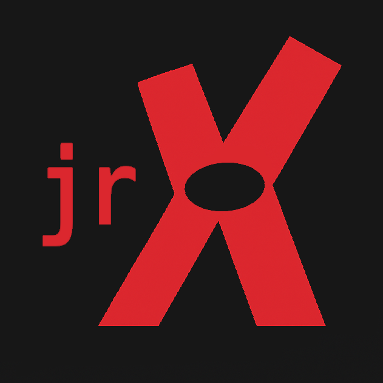

# JRX



**`jrx`** is a modern, Cargo-inspired command-line tool written in Golang, designed to streamline the development lifecycle of Go projects. From scaffolding to building and analyzing dependencies, `jrx` offers a developer-friendly interface with powerful functionality

## Features

- 🔧 `jrx new <project>` — Create a new project scaffold with a structured layout:
    ```bash
    myProject/
        ├── bin/
        ├── doc/
        ├── lib/
        ├── src/
        ├── main.go
        ├── Makefile
        └── Dockerfile
    ```
- 📦 `jrx mod <project>` — Equivalent to `go mod init`.

- 🛠️ `jrx build <project>` — Builds the project. If the module is not initialized, it initializes it first.
   - With flags as `arch` and `os` to build multiarchitecture binaries.

- 🔍 `jrx info <project>` — Displays:
   - Size of the binary file(s) in the `bin` folder.
   - Dependencies listed in `go.sum`.
   - Known vulnerabilities using the [OSV.dev](https://osv.dev) CVE database.

---

## 🛡️ Vulnerability Scanning

`jrx info --osv` uses the [OSV.dev API](https://osv.dev) to check for known vulnerabilities in Go dependencies. It automatically scans each dependency version listed in `go.sum` and outputs any relevant CVEs.

---

## 📁 Usage

```bash
NAME:
   jrx - Just a simple go wrapper CLI

USAGE:
   jrx [global options] command [command options]

COMMANDS:
   info, i   get information from the project
   new, n    Create a new project
   build, b  build and compile a project
   mod, m    start a simple go.mod file
   help, h   Shows a list of commands or help for one command

GLOBAL OPTIONS:
   --help, -h  show help
```